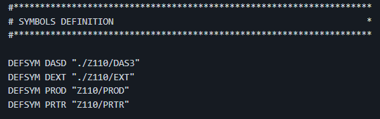

# Guide installation ZOS sur votre PC

## 1. Pre-requirements 

- Un logiciel de téléchargement Peer 2 Peer (Torrent)
- Entre 30Go et 60Go pour être large
- De la patience.

## 2. Téléchargement ZOS

Une fois que vous avez un logiciel de Torrent, cliquez sur ce lien.
[Lien torrent Z OS](magnet:?xt=urn:btih:MD3UK2UG7RX66BJXX3RMESC2TBPEBVMV&dn=IBM+ADCD+Z%2FOS+1.10&tr=udp://tracker.publicbt.com:80/announce)


## 3. Téléchargements émulateurs

Il vous faut également installer :
- [Hercules](http://www.hercules-390.eu/) - Regardez la bonne version à installer.
- [Un 3270](https://www.tombrennansoftware.com/download.html) - Vous l'aurez deviné, il s'agit de... VISTA <3


## 4. Préparation d'Hercules
Alors. Préparez vous.
Là vous avez téléchargé les fichiers mais maintenant il va falloir les RACCORDER.
En fait, dans votre dossier d'installation Hercules, vous avez un fichier hercules.cnf.
Ce fichier s'occupe de... la configuration oui.

Je vous invite à remplacer son contenu, par ça.

```
#********************************************************************
# CONFIGURAGION FILE FOR ADCD Z/OS 1.10 SUMMER                      *
#********************************************************************
# FOR ALL THE LOADPARM OPTIONS VISIT:                               *
# http://dtsc.dfw.ibm.com/MVSDS/'HTTPD2.ADCD.GLOBAL.HTML(READ110S)' *
#********************************************************************

ARCHMODE  z/Arch
OSTAILOR  z/OS
CPUSERIAL 08A89F
CPUMODEL  2084
CNSLPORT  3270
LPARNAME  ADCD
LOADPARM  0A82CS
#LOADPARM  0A82CM
MODEL     EMULATOR
PLANT     ZZ
MAINSIZE  1024
NUMCPU    2
SYSEPOCH  1900
TZOFFSET  -0000
HTTPPORT  8080 NOAUTH
#HTTPPORT  8080 AUTH HERCULES HERCULES
PANTITLE  "ADCD z/OS 1.10 on Hercules"
PANRATE   FAST
PGMPRDOS  LICENSED

#********************************************************************
# SYMBOLS DEFINITION                                                *
#********************************************************************

DEFSYM DASD "./Z110/DAS3"
DEFSYM DEXT "./Z110/EXT"
DEFSYM PROD "Z110/PROD"
DEFSYM PRTR "Z110/PRTR"

#********************************************************************
# ORIGINAL ADCD z/OS 1.10 SUMMER IMAGES                             *
#********************************************************************

#000F    1403 $(PRTR)/IBM/PRTR.000F
0A80    3390 $(DASD)/ibm.adcd.zos.1.10.disk.20.of.26.zares1.cckd 
0A81    3390 $(DASD)/ibm.adcd.zos.1.10.disk.21.of.26.zares2.cckd 
0A82    3390 $(DASD)/ibm.adcd.zos.1.10.disk.22.of.26.zasys1.cckd 
0A83    3390 $(DASD)/ibm.adcd.zos.1.10.disk.23.of.26.zauss1.cckd 
0A84    3390 $(DASD)/ibm.adcd.zos.1.10.disk.16.of.26.zaprd1.cckd 
0A85    3390 $(DASD)/ibm.adcd.zos.1.10.disk.17.of.26.zaprd2.cckd 
0A86    3390 $(DASD)/ibm.adcd.zos.1.10.disk.18.of.26.zaprd3.cckd
0A87    3390 $(DASD)/ibm.adcd.zos.1.10.disk.19.of.26.zaprd4.cckd
0A88    3390 $(DASD)/ibm.adcd.zos.1.10.disk.15.of.26.zaims1.cckd
0A89    3390 $(DASD)/ibm.adcd.zos.1.10.disk.02.of.26.zacic1.cckd 
0A8A    3390 $(DASD)/ibm.adcd.zos.1.10.disk.07.of.26.zadb91.cckd
0A8B    3390 $(DASD)/ibm.adcd.zos.1.10.disk.08.of.26.zadb92.cckd 
0A8C    3390 $(DASD)/ibm.adcd.zos.1.10.disk.03.of.26.zadb81.cckd
0A8D    3390 $(DASD)/ibm.adcd.zos.1.10.disk.04.of.26.zadb82.cckd
0A8E    3390 $(DASD)/ibm.adcd.zos.1.10.disk.05.of.26.zadb83.cckd
0A8F    3390 $(DASD)/ibm.adcd.zos.1.10.disk.06.of.26.zadb84.cckd
0A91    3390 $(DASD)/ibm.adcd.zos.1.10.disk.01.of.26.sares1.cckd        
0A92    3390 $(DASD)/ibm.adcd.zos.1.10.disk.09.of.26.zadis1.cckd
0A93    3390 $(DASD)/ibm.adcd.zos.1.10.disk.10.of.26.zadis2.cckd
0A94    3390 $(DASD)/ibm.adcd.zos.1.10.disk.11.of.26.zadis3.cckd
0A95    3390 $(DASD)/ibm.adcd.zos.1.10.disk.12.of.26.zadis4.cckd
0A96    3390 $(DASD)/ibm.adcd.zos.1.10.disk.13.of.26.zadis5.cckd
#********************************************************************
# CUSTOM IMAGES                                                     *
#********************************************************************
# VOLUME NAMING CONVENTION                                          *
# .-----> 1 CHAR SYSPLEX NAME (SYSPLX "A")                          *
# |.--.-> 3 CHAR PURPOSE RES=SYSRES SPL=SPOOL CKP=CHECKPOINT        *
# ||   \>                USR=USER CFG=SYS PAG=PAGE SMS=SMS          *
# ||  .-> SEQUENCE OR SYSCLONE FOR CONFIGURATION VOLUME             *
# VV  V                                                             *
# xxxxxx                                                            *
#********************************************************************
0AA0    3390 $(DASD)/ibm.adcd.zos.1.10.disk.14.of.26.zadis6.cckd
0AA1    3390 $(DASD)/ibm.adcd.zos.1.10.disk.24.of.26.zawas1.cckd
0AA2    3390 $(DASD)/ibm.adcd.zos.1.10.disk.25.of.26.zawas2.cckd
0AA3    3390 $(DASD)/ibm.adcd.zos.1.10.disk.26.of.26.zawas3.cckd

#0AC1    3390 $(DEXT)/vpd81a_1.ac1
0AAD    3390 $(DEXT)/SPL001.CCKD
0AAE    3390 $(DEXT)/SPL002.CCKD
0AB7    3390 $(DEXT)/SPL003.CCKD
0AA4    3390 $(DEXT)/SPL004.CCKD
0AA5    3390 $(DEXT)/SPL005.CCKD
0AA6    3390 $(DEXT)/CKP001.CCKD
0AA7    3390 $(DEXT)/CKP002.CCKD
0AAA    3390 $(DEXT)/USS001.CCKD
0AAB    3390 $(DEXT)/AUT001.CCKD
0AAC    3390 $(DEXT)/DMP001.CCKD
0AAF    3390 $(DEXT)/AZZSAD.CCKD
0AB0    3390 $(DEXT)/USR001.CCKD
0AB1    3390 $(DEXT)/USR002.CCKD
0AB2    3390 $(DEXT)/USR003.CCKD
0AB3    3390 $(DEXT)/USR004.CCKD
0AB4    3390 $(DEXT)/USR005.CCKD
0AB5    3390 $(DEXT)/EQQ001.CCKD
0AB6    3390 $(DEXT)/SYS001.CCKD
#********************************************************************
# DISPLAY TERMINALS                                                 *
#********************************************************************
0700    3270
0701    3270
0703    3270
0704    3270
0705    3270
0706    3270
0707    3270
#********************************************************************
# CTCI COMMUNICATION DEVICES                                        *
#********************************************************************
#0E20-0E21 CTCI XXX.XXX.X.XXX  YYY.YYY.Y.YY       
#    XXX.XXX.X.XXX =  adresse IP donné à votre Host Z/OS       
#    YYY.YYY.Y.Y  =   adresse IPV4 de votre PC
*********************************************************************
# HOST OS TIPS/TRICKS                                               *
#********************************************************************
#route add 172.16.3.8 dev tun0
#route add 192.168.1.0 mask 255.255.255.0 10.1.2.1 metric 1


```

## 5. Chemin ZOS

Maintenant, dans ce même fichier, vous cherchez la ligne où se trouve 'DEFSYM DASD "Z110/DASD"'. (ligne 32 normalement)



Les DEFSYM c'est des raccourcis de chemins d'accès.  
- J'ai assigné DASD aux 26 partitions du système d'exploitation
- Mais aussi DEXT aux autres partitions qui ne font pas parti du système (c'est plus des disques durs vierges)

A vous d'organiser vos chemin. Vous pouvez mettre les memes chemins si vous avez mis tous les fichiers au même endroit.

Donc vous remplacez Z110/DASD par le chemin d'installation de votre ZOS. Ca devrait finir par le nom du dossier contenant vos fichiers ZOS (exemple TOTO). 
Exemple : C:/Program/Truc/TOTO

ATTENTION :  
- Le chemin d'accès ne doit pas contenir d'espace, veuillez mettre vos fichiers à un chemin qui ne contient pas d'ESPACE


## 6. Fin

Là vous pouvez mettre en raccourci VISTA TN3270 et Hercules.exe
Vous aurez qu'à faire ce que vous savez déjà faire : 
- Lancer Hercules
- Lancer et connecter vos 3270
- Lancer ```ipl a80``` dans hercules

Et voilà, vous êtes good!


## 7. Petits soucis?

Mais là, vous aurez surement une petite erreur dans la console TSO 700 (la master).  
Vous aurez remarqué qu'elle est gelée sur quelques lignes bleues...   
Il va vous demander une reponse, il faudra lui répondre :
```R 00 I``` ou
```R 00 U``` 

## 8. Bonus

Si vous voulez changer le fond d'écran de votre 3270 quand il affiche HERCULES
Vous pouvez remplacer le contenu de herclogo.txt (Max 79 * 24 caractères).